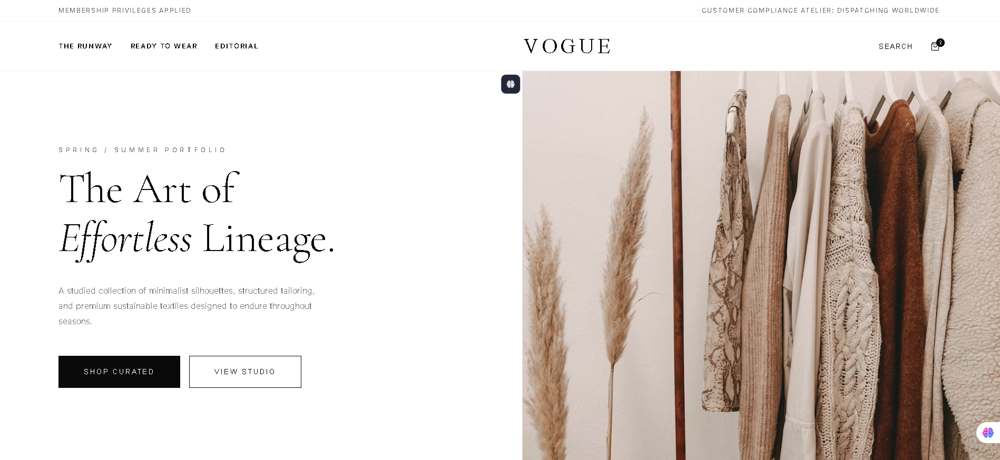
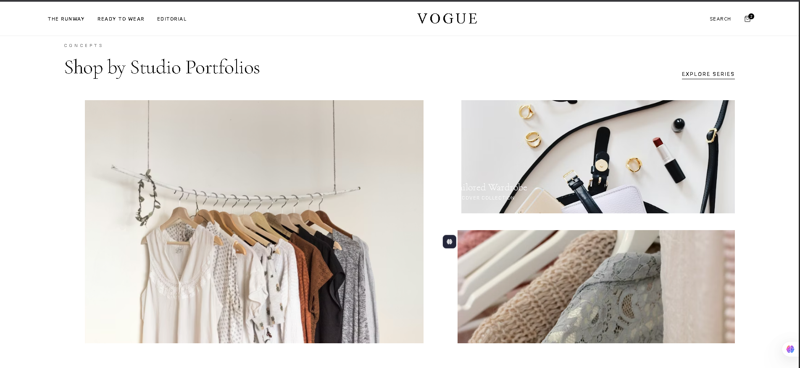
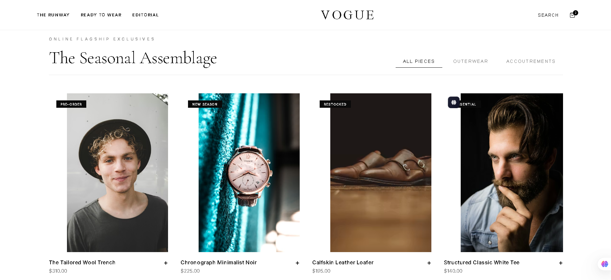
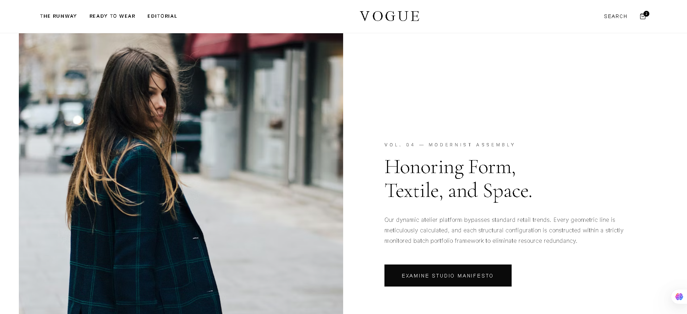
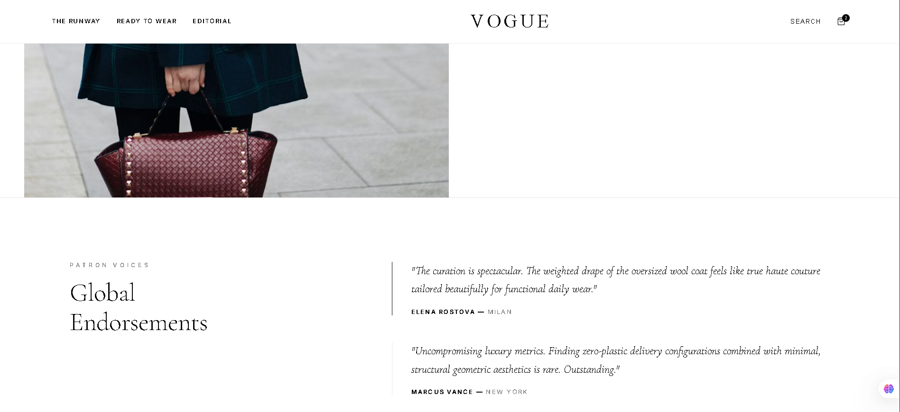
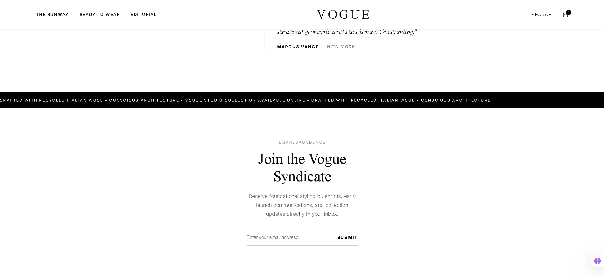

# VOGUE — Modernist E-Commerce Atelier

A high-end, responsive minimalist e-commerce concept built using React. This digital lookbook application features structured layout symmetries, smooth shopping drawer layers, dynamic catalog grouping, and an architectural luxury brand ecosystem.

## 🚀 Live Application Previews

Below are the interface layers captured from the active application environment:

### 1. Editorial Hero Cover Panel

### 2. Studio Portfolios & Concept Grids (part 1)

### 3. Studio Portfolios & Concept Grids (part 2)

### 4. The Seasonal Assemblage Catalog

### 5. Modernist Manifesto Block

## 6. Client Feedback & Correspondence Hub

### 7. Client Feedback & Correspondence Hub

---

## 🛠️ Tech Stack & Architecture

- **Framework:** React.js (Functional Architecture & Hooks)
- **Styling:** Inline Architectural Design System (Vanilla CSS Properties)
- **Asset Directory:** Served natively via the standalone `/public` configuration container

## ⚙️ Local Development Instructions

1. Clone the repository
2. Install dependencies: `npm install`
3. Run the local server: `npm start`